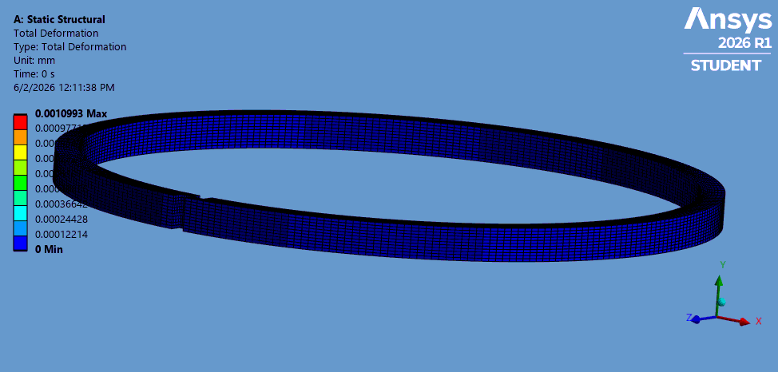
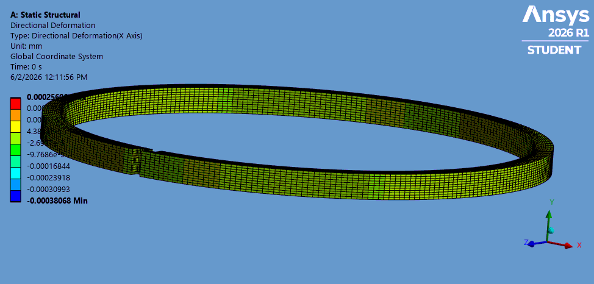
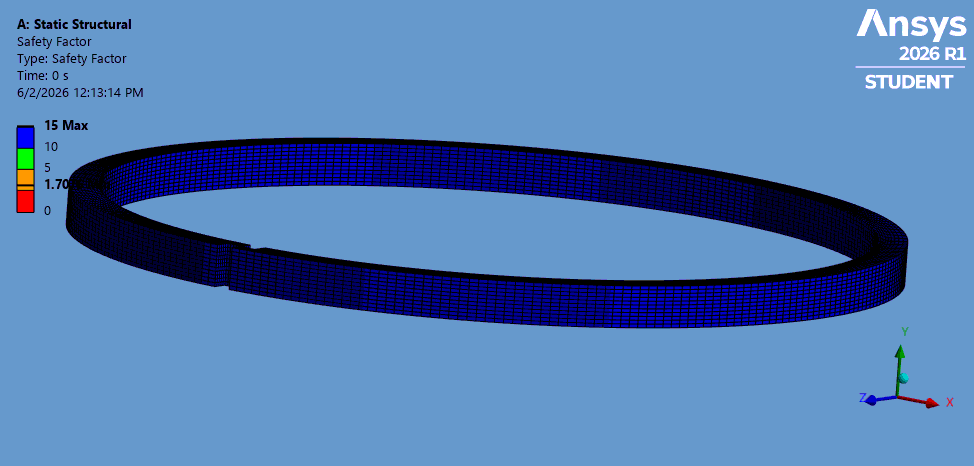

# Piston Ring — Structural FEA (ANSYS)

Structural finite element analysis (FEA) of an internal combustion engine **piston ring**,
carried out in **ANSYS 2026 R1** as part of a Smart Manufacturing course project.
The study evaluates how the ring behaves under mechanical load: stress, deformation and
safety factor.

---

## Overview

The goal was to check whether a piston ring can withstand realistic mechanical loading
during engine operation. Using ANSYS Static Structural, I applied loads and boundary
conditions to the ring and evaluated the resulting stress, deformation and safety factor.

**Part analysed:** piston ring
**Software:** ANSYS 2026 R1 (Student)
**Analysis type:** Static Structural

---

## Analysis Setup

**Material:** Structural Steel
**Loads / boundary conditions:**
- Radial pressure = 1 MPa applied on the outer surface, directed inward

---

## Results

| Result | Value |
|---|---|
| Max equivalent (von-Mises) stress | 121.22 MPa |
| Total deformation (max) | ~0.0011 mm |
| Minimum safety factor | ~1.7 |

**Interpretation:**
A minimum safety factor of ~1.7 means the ring does **not** fail under the applied working
load (any value above 1 survives). However, for a safety-critical engine component this is a
modest margin — a higher safety factor (typically 2–3) would be preferable. To improve it, the
design could be made thicker or the material changed. Given the project time frame, the design
was presented at this result while being aware of the improvement direction.

### Result Plots

**Equivalent (von-Mises) Stress**

**Total Deformation**

**Directional Deformation**

**Safety Factor**

---

## What I Learned

- How to set up a Static Structural simulation in ANSYS: material, loads, boundary conditions
- How to read von-Mises stress and safety factor to judge whether a part survives its load
- How to interpret deformation results and connect them to design decisions
- How to critically assess a result (a 1.7 safety factor is acceptable but not ideal) and
  identify how the design could be improved

---

## Tech / Tools

ANSYS 2026 R1 (Static Structural) · Finite Element Analysis (FEA) · Engineering simulation

---

## Author

**Ahmet Nizar Bagdatli**
Applied Mechatronic Systems student — SRH Berlin University of Applied Sciences
GitHub: [github.com/nizarbagdatli](https://github.com/nizarbagdatli)

*Structural analysis carried out by me as part of a Smart Manufacturing team project (Group 4).*
